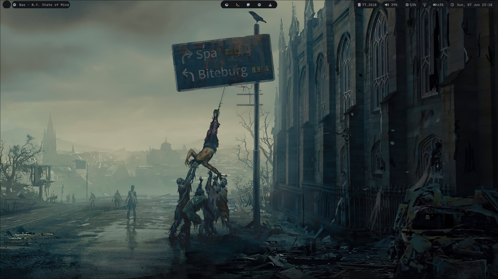
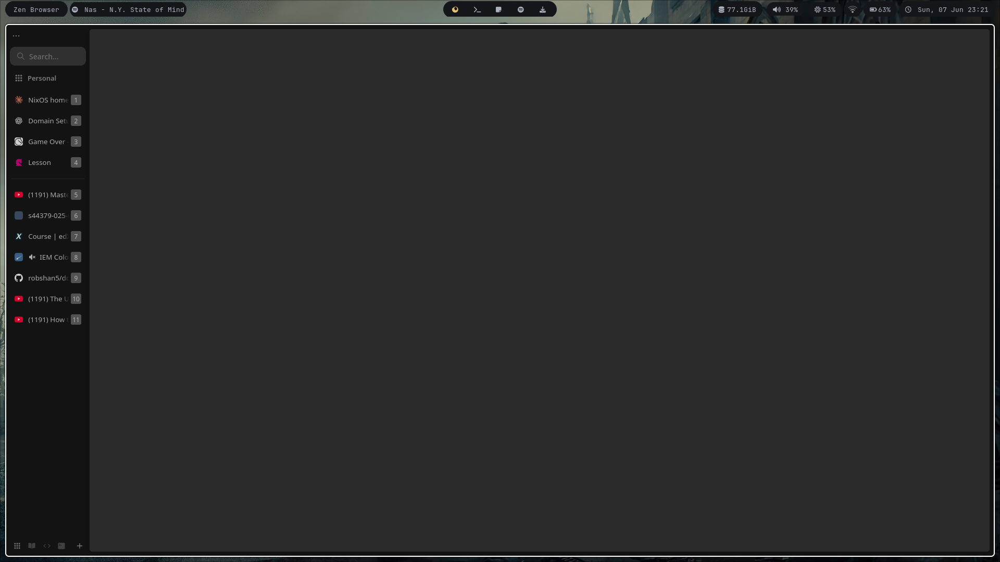
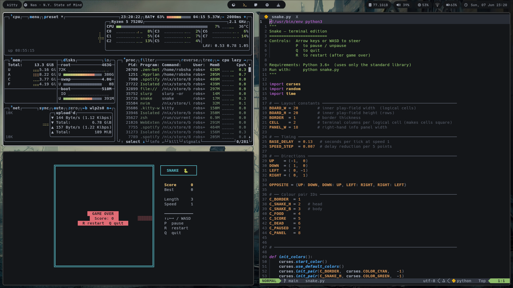
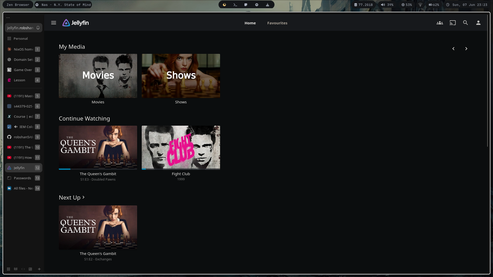
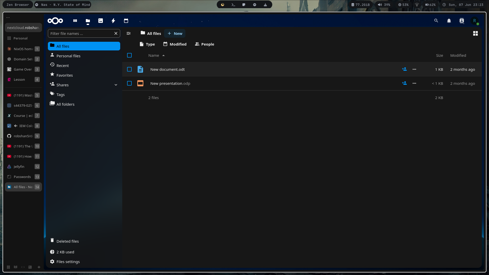

# Dotfiles

> Personal NixOS configuration managed with **Nix Flakes** and **Home Manager** — structured around separate host and user profiles for easy replication across machines.



---

## Directory structure

```
dotfiles/
├── accounts/          # User account definitions
├── hosts/             # Per-machine hardware and system configuration
├── system/            # Shared system-level NixOS modules
├── user/              # Shared user-level Home Manager modules
├── flake.nix          # Flake entrypoint — defines hosts and users
├── home.nix           # Home Manager configuration root
└── configuration.nix
```

---

## Setup

This guide covers setting up the config on a fresh NixOS install.

### 1. Enable flakes

Add flake support to `/etc/nixos/configuration.nix`:

```nix
nix.settings.experimental-features = ["nix-command" "flakes"];
```

Rebuild and confirm git is installed:

```bash
sudo nixos-rebuild switch
```

### 2. Clone and apply system config

```bash
git clone https://github.com/robshan5/dotfiles
cd dotfiles
```

Rebuild the system using the flake, specifying your host:

```bash
sudo nixos-rebuild switch --flake .#<host>
```

> Replace `<host>` with the machine name defined in `hosts/` — e.g. `.#Balor` (desktop), `.#Lugh` (laptop) or `.#Dullahan` (server).

### 3. Set up Home Manager

Add the Home Manager channel, matching the version to your NixOS release:

```bash
nix-channel --add https://github.com/nix-community/home-manager/archive/release-25.05.tar.gz home-manager
nix-channel --update
```

> For NixOS unstable, use `master.tar.gz` instead of `release-25.05.tar.gz`.

Install Home Manager:

```bash
nix-shell '<home-manager>' -A install
```

Apply the Home Manager config (flake outputs are named `<user>@<host>`):

```bash
home-manager switch --flake .#"$(whoami)@$(hostname)"
```

> The `hman` and `rebuild` zsh functions fill this in automatically from the current user and hostname, so normally you just run `hman` or `rebuild`.

---

## Screenshots

| | |
|---|---|
|  |  |
|  |  |

---

## Requirements

- A fresh [NixOS](https://nixos.org/) installation
- Internet connection for fetching packages
